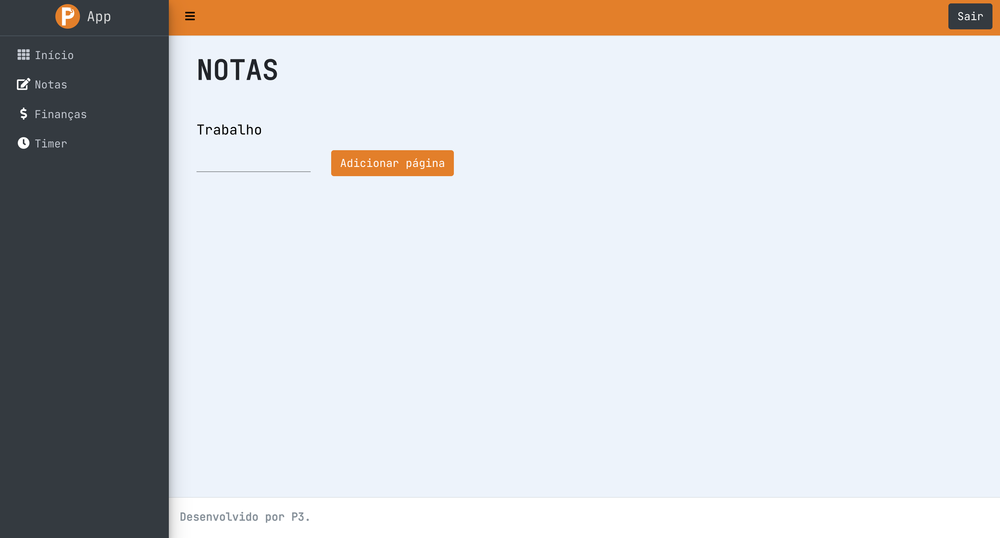
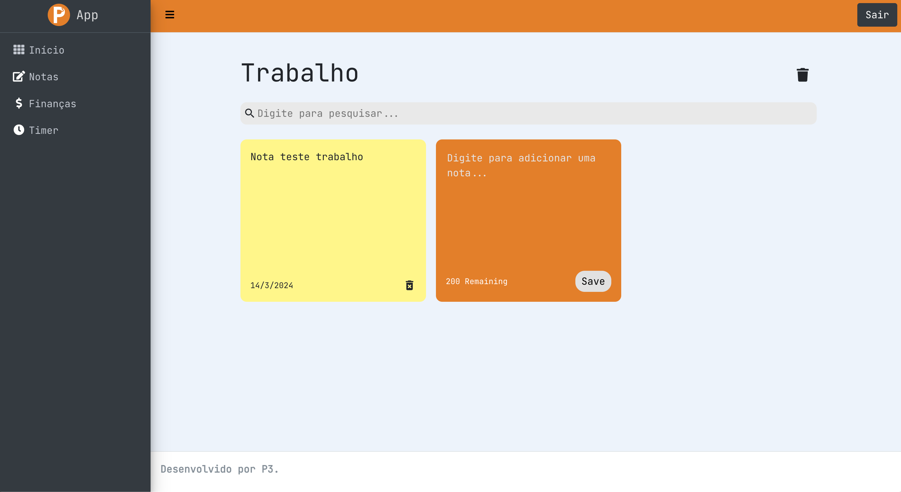
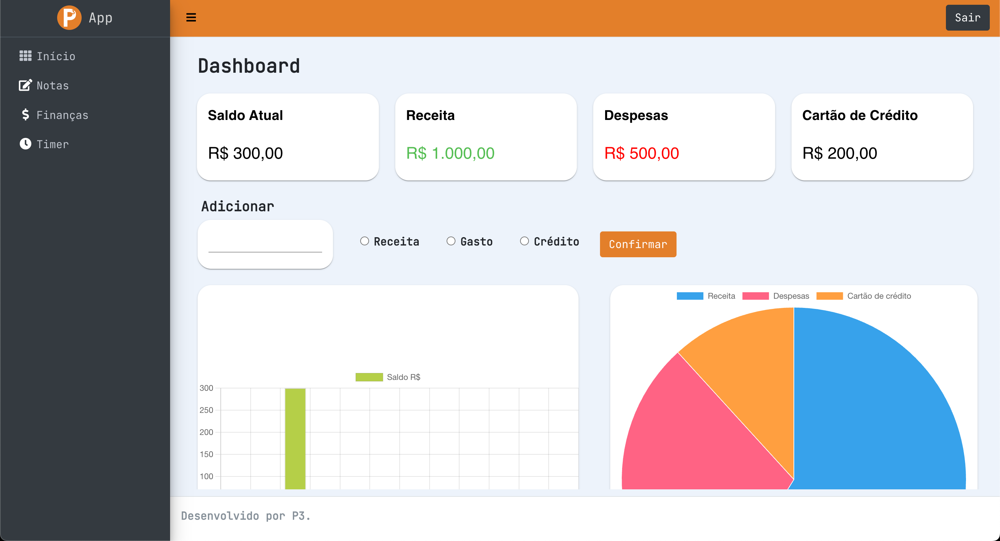
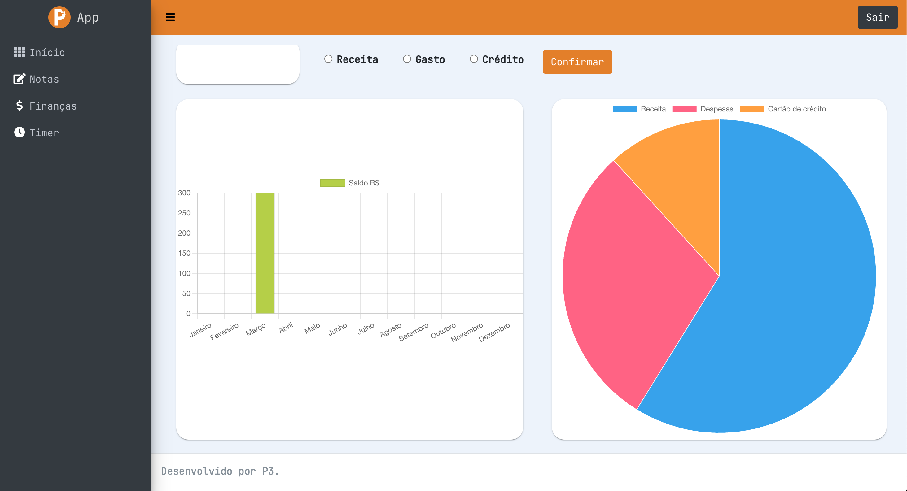
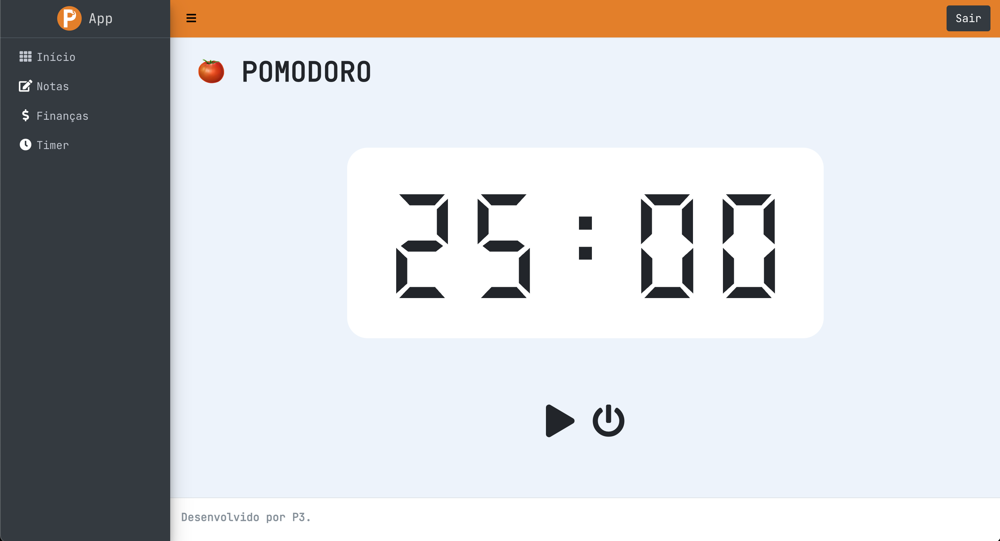

# Aplicação web para gerenciamento de tempo e tarefas

## Conceito do projeto
Este projeto foi realizado com a finalidade de projetar uma aplicação capaz de agregar em seu interior uma única ferramenta para que seus usuários possam criar e gerenciar anotações e despesas, e cronometrar períodos de estudo conforme a metodologia pomodoro. Com o intuito de estudar e se aprofundar em conceitos do desenvolvimento web e como ele pode se relacionar com a cibersegurança, para isto, nossa aplicação conta com um sucinto sistema de login que utiliza conceitos de segurança para garantir que cada usuário possa ter acesso único aos seus arquivos.

## Pré-Requisitos e recursos utilizados
O grupo utilizou as linguagens JavaScript, HTML, CSS e React para o desenvolvimento do projeto, utilizando as bibiliotecas que estão descritas em:
```
package-lock.json
```
## Passo a passo
1. Criação e desenvolvimento de protótipo utilizando a ferramenta Figma
2. Criação da página de ínicio
3. Criação da página Notas
4. Criação da página Finanças
5. Criação da página Timer
6. Criação do login, do cadastro e da autenticação
   
## Execução
Para executar o projeto deve ser instalado localmente o node.js, e com isso ao abrir os arquivos tanto do front quanto do back devem ser instaladas todas as as dependências pelo comando:
```
npm install
```
Para que o app funcione em sua totalidade é necessário tambêm fazer a importação do dump do banco de dados localizado em P3-BD em algum workspace mysql.
Obs: nessa etapa é importante configurar os models do backend de acordo com suas configurações de banco de dados local, para isso entre nos arquivos models de P3-back/src/models e em cada arquivo ajustar de acordo com usuário e senha local do mysql no Sequelize.

Para iniciar o projeto deve ser disparado o seguinte comando tanto no front quanto no back:
```
npm start
```
## Autores
* Pedro Gonçalves Correia
* Pedro Enrico Nogueira Barchi
* Pedro Henrique Alves de Araujo Silva

## Imagens/screenshot

 <br>
 <br>
 <br>
 <br>
 <br>
 <br>
